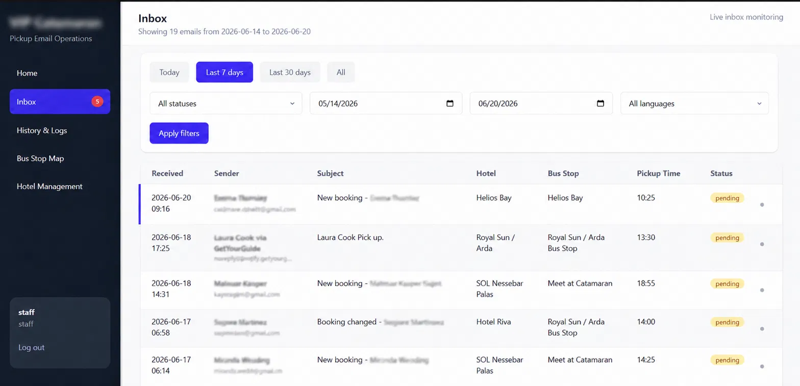
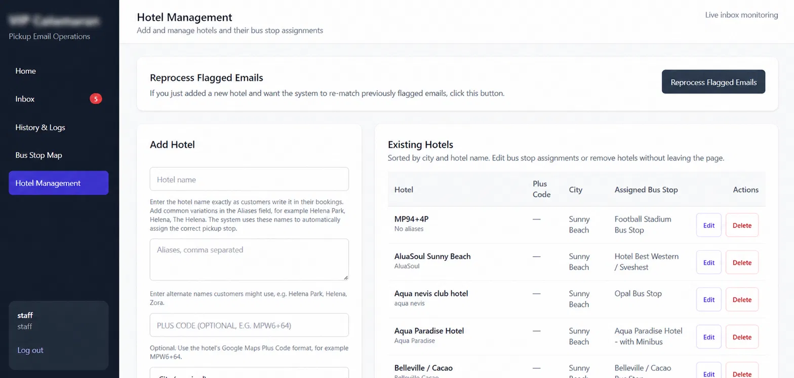

# Riviera Tours Demo Dashboard

> 🔗 **[Live Demo](https://tour-operator-dashboard-demo-production.up.railway.app)** — Login: `demo_staff` / `demo123`

An automation dashboard that reads booking emails, matches customers to the correct pickup point, and generates ready-to-send replies — built for tour operators who manage logistics across multiple hotels and pickup stops.

## Proven in production

This demo is a sanitized version of a system built and deployed for a real boat tour company on the Bulgarian Black Sea coast, currently used daily by staff to handle real customer bookings.

In production this system handles:
- 1000+ processed booking emails
- 20+ real pickup locations across multiple towns
- Daily use by a 3-person staff team
- Live multi-user presence tracking (see who's viewing which email in real time)
- Automated CI/CD deployment pipeline with test gating and nightly database backups
- Full security hardening: CSRF protection, hardened sessions, validated configuration

*(Screenshots below are from the production system, with all customer and staff identifying details removed.)*

## What it does

1. **Reads booking emails** automatically from a connected mailbox (supports GetYourGuide, Bookeo, and similar OTA formats)
2. **Extracts booking details** — customer name, hotel, date, time, party size
3. **Matches the customer's hotel** to the nearest pickup point using fuzzy string matching
4. **Generates a draft reply** with the correct pickup location, time, and instructions — in the right language
5. **Staff review and send** — nothing goes out automatically, every reply is reviewed by a human first

## Try it yourself

Visit the [live demo](https://tour-operator-dashboard-demo-production.up.railway.app) and log in with:
- Staff view: `demo_staff` / `demo123`
- Admin view: `demo_admin` / `demo123`

Explore the inbox, open a sample booking, see how the draft reply is generated, and check out the Hotel Management page to see how pickup points are configured.

## Tech stack

- **Backend:** FastAPI, SQLAlchemy, SQLite
- **Frontend:** Jinja2, Tailwind CSS
- **Email:** IMAP/SMTP integration with automatic polling (APScheduler)
- **Real-time:** Server-Sent Events for live presence tracking
- **Deployment:** Hetzner VPS, Caddy reverse proxy, systemd, GitHub Actions CI/CD
- **Security:** CSRF protection, hardened sessions, validated startup configuration, automated backups

## Customization options

Every deployment is tailored to the client's actual operation:

- **Branding** — company name, colors, logo
- **Location data** — real hotels, pickup points, and routes configured for your business
- **Languages** — reply generation in the languages your customers actually use
- **Booking platform support** — parsing tuned to the OTAs you receive bookings from (GetYourGuide, Bookeo, Viator, and others)
- **Reply wording** — matched to your brand voice and operational requirements
- **Ongoing maintenance** — monthly upkeep plus hourly support for new features as your business grows

## Roadmap

- Hotel-to-pickup point image attachments in replies, so customers can see exactly where to wait
- Configurable multi-tenant support for managing multiple client deployments from one codebase
- Expanded booking platform integrations
- Customer-facing pickup point confirmation via SMS

## About this demo

This version uses entirely fictional data — "Riviera Tours Demo," "Bay Harbor," and "Coral Cove" are not real places or companies. No real client or customer data is included anywhere in this repository.

## Built by

Presiyan Nikolov — freelance developer, building automation tools for tour and hospitality businesses.

LinkedIn: https://www.linkedin.com/in/presiyan-nikolov-714246345/
